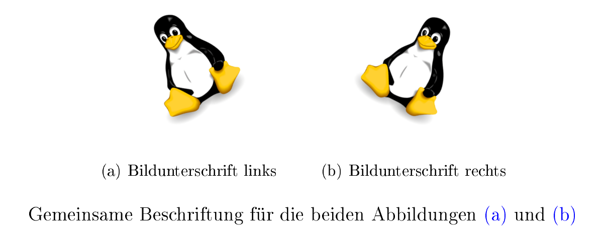

.. index:: Umgebung
.. _Wichtige Umgebungen:

Wichtige Umgebungen
===================

So genannte Umgebungen werden in LaTeX verwendet, um einzelne Absätze zu
gestalten. Üblicherweise werden Umgebungen mit ``\begin{umgebung}`` eingeleitet
und mit ``\end{umgebung}`` abgeschlossen.

Die im folgenden Abschnitt aufgelisteten Umgebungen sind standardmäßig in LaTeX
definiert; weitere Umgebungen können durch das Einbinden von :ref:`Zusatzpaketen <Zusatzpakete>`
genutzt werden.

``center``, ``flushleft``, ``flushright`` -- Textausrichtung
------------------------------------------------------------

Normalerweise wird Text in Latex als Blocksatz dargestellt. LaTeX optimiert
dabei den Abstand zwischen einzelnen Wörtern und nimmt automatisch eine
Silbentrennung vor. Mittels der folgenden Umgebungen kann die Ausrichtung eines
Absatzes manuell geändert werden:

.. index:: center (Umgebung)

* *Zentrierung:* Bereiche eines LaTeX-Dokuments, die zwischen ``\begin{center}`` und
  ``\end{center}`` stehen, werden mittig auf der Seite ausgegeben.

.. index:: flushleft (Umgebung), flushright (Umgebung)

* *Flattersatz:* Bereiche eines LaTeX-Dokuments, die innerhalb einer
  ``\begin{flushleft}`` und ``\end{flushleft}`` stehen, werden linksbündig als
  Flattersatz ausgegeben. Entsprechend werden Bereiche, die zwischen
  ``\begin{flushright}`` und ``\end{flushright}`` stehen, rechtsbündig als
  Flattersatz ausgegeben.

.. todo raggedright, raggedleft

Die Flattersatz-Umgebungen werden üblicherweise für Text oder mathematische
Formeln verwendet; Zentrierungen sind hingegen auch für Abbildungen, Tabellen
oder dergleichen üblich.

.. only:: html

    .. index:: Aufzählung

.. _itemize:
.. _enumerate:
.. _description:

``itemize``, ``enumerate`` und ``description`` -- Aufzählungen
--------------------------------------------------------------

In LaTeX gibt es folgende Umgebungen für Aufzählungen:

.. index:: Aufzählung; nicht nummeriert, itemize (Umgebung)

* Mit einer ``itemize``-Umgebung kann eine nicht nummerierte Aufzählung
  erstellt werden. Die einzelnen aufzuzählenden Punkte werden mittels
  der Anweisung ``\item`` gelistet:

  .. code-block:: tex

      \begin{itemize}

          \item ...
          \item ...
          \item ...

      \end{itemize}

  Innerhalb der einzelnen Einträge werden Leerzeilen berücksichtigt,
  zwischen den einzelnen Einträgen werden Leerzeilen ignoriert.

.. Rendtel2010
.. Aufzählungen verändern

.. Manchmal will man ja nicht nur einfache Zahlen oder Punkte als Aufzählung haben,
.. sondern Pfeile oder ähnliches. Dazu definiert man sich das \labelitemi um mit
.. z.B.

.. \renewcommand{\labelitemi}{\ding{99}}

.. Dies liefert ein Sternen in der Aufzählung.

.. Um genau zu wissen, welche Zeichen einem zum Verfügung stehen, hier die Zeichen des ZapfDing-
.. Bats. Vorher muss man übrigens das Paket pifont eingebunden haben.

.. \setlength{\itemsep}{0pt}

.. index:: Aufzählung; nummeriert, enumerate (Umgebung)

* Mit einer ``enumerate``-Umgebung kann eine nummerierte Aufzählung erstellt
  werden. Die einzelnen aufzuzählenden Punkte werden ebenfalls mittels der
  Anweisung ``\item`` gelistet:

  .. code-block:: tex

      \begin{enumerate}

          \item ...
          \item ...
          \item ...

      \end{enumerate}

.. index:: description (Umgebung)

* Mit einer ``description``-Umgebung kann eine Stichwort-Aufzählung erstellt
  werden. Die einzelnen aufzuzählenden Punkte werden mittels der Anweisung
  ``\item[Stichwort]`` gelistet:

  .. code-block:: tex

      \begin{description}

          \item[Stichwort 1:] ...
          \item[Stichwort 2:] ...
          \item[Stichwort 3:] ...

      \end{description}

Aufzählungs-Umgebungen können in LaTeX auch (maximal vierfach) geschachtelt
auftreten, beispielsweise kann eine ``itemize``-Umgebung innerhalb einer
``enumerate``-Umgebung stehen:

.. code-block:: tex

    \begin{enumerate}

        \item ...

        \item

        \begin{itemize}

            \item ...
            \item ...

        \end{itemize}

        \item ...

    \end{enumerate}

LaTeX passt die Einrückungstiefen der Aufzählungen sowie die Art der
Anführungszeichen, soweit nicht manuell vorgegeben, automatisch an. Einrückungen
innerhalb des Quellcodes haben keine Auswirkung auf die PDF-Datei, sind aber für
eine bessere Lesbarkeit empfehlenswert.

.. _Abstände zwischen Einträgen anpassen:

.. rubric:: Abstände zwischen Einträgen anpassen

LaTeX lässt zwischen den einzelnen Einträgen einer Aufzählung verhältnismäßig
viel Abstand, um die Lesbarkeit zu erhöhen. Bisweilen ist es allerdings aus
Platzgründen hilfreich, eine Aufzählung möglichst kompakt zu halten. In diesem
Fall sind vor allem zwei Anweisungen nützlich:

* Mit ``\vspace{-2mm}`` kann der Abstand zwischen dem vorherigen Absatz und dem
  Beginn der Aufzählung reduziert werden.
* Mit ``\setlength\itemsep{0mm}`` wird der *zusätzliche* Abstand zwischen
  den einzelnen Einträgen auf Null reduziert; die einzelnen Einträge haben somit
  nur einen normalen Zeilenabstand.

Als Alternative zu dieser manuellen Anpassung kann auch das Zusatz-Paket
:ref:`paralist <paralist>` verwendet werden, das kompakte Versionen der normalen
Aufzählungs-Umgebungen bereitstellt.

.. index:: \includegraphics{}, figure (Umgebung), Abbildung, Graphik,
    Umgebung; Fließumgebung, Gleitobjekt, Fließumgebung
.. _figure:

``figure`` -- Abbildungen
-------------------------

Die ``figure``-Umgebung ist zum Einbinden von Abbildungen vorgesehen; hierzu
muss in der Präambel des Dokuments das Paket ``graphicx`` mittels
``\usepackage{graphicx}`` geladen werden.

Bei der ``figure``-Umgebung handelt es sich um eine so genannte "Fließumgebung"
(bisweilen auch "Gleitobjekt" genannt), bei der LaTeX selbst anhand von
angegebenen Optionen entscheidet, an welcher Stelle die Abbildung am besten
eingebaut wird:

.. code-block:: tex

    % In der Präambel:

    \usepackage{graphicx}

    % Innerhalb des Dokuments:

    \begin{figure}[htb]
        \centering
        \includegraphics[width=0.8\linewidth]{image-filename.png}
        \caption{Hier kommt die Bildunterschrift hin.}
        \label{fig-image-label}
    \end{figure}

.. \includegraphics[width=0.5\linewidth,angle=90,page=1]{meinepdfdatei}

In diesem Beispiel sind als Optionen für mögliche Positionierungen der Abbildung
``htb`` angegeben: ``h`` ("here") steht für die aktuelle Position, ``t`` ("top")
für den Beginn der aktuellen Seite, ``b`` ("bottom") für das Ende der aktuellen
Seite; eine weitere mögliche Option ist ``p`` ("page"), bei der die Abbildung
optional auch auf einer separaten Seite gedruckt werden darf. Mittels eines
Ausrufezeichens kann eine Position erzwungen werden, beispielsweise bewirkt eine
Optionsangabe von ``[h!]``, dass die Abbildung unbedingt an der aktuellen Stelle
eingebunden werden soll.

Das eigentliche Einfügen der Graphik wird durch die Anweisung
``\includegraphics{}`` übernommen. Als Optionen kann hierbei mittels ``width``
oder ``height`` die Größe der Abbildung im Dokument festgelegt werden, mittels
``angle=90`` kann die Abbildung zudem bei Bedarf um den angegebenen Winkel
(gegen den Uhrzeigersinn) gedreht werden. Als Bildformate können bei Verwendung
von ``pdflatex`` wahlweise ``png``, ``jpg`` oder ``bmp`` verwendet werden.

*Beispiel:*

.. code-block:: tex

    \begin{figure}[h!]
        \centering
        \includegraphics[width=0.5\textwidth]{pics/tux.png}
        \caption{Das Linux-Maskottchen `Tux'.}
        \label{fig-tux}
    \end{figure}

*Ergebnis:*

Befinden sich die Bilddateien nicht im gleichen Verzeichnis wie die
``.tex``-Datei, so kann bei der ``\includegraphics{}``-Anweisung auch ein
relativer oder absoluter Pfad angegeben werden. Hierbei muss allerdings geachtet
werden, dass in dem Pfadnamen keine Leerzeichen oder Unterstriche vorkommen; ist
dies der Fall, so muss vor diese "Sonderzeichen" je ein Backslash-Zeichen ``\``
geschrieben werden. Empfehlenswert ist es daher, alle zu einem LaTeX-Dokument
gehörenden Bilddateien in einem Unterordner ``pics`` abzulegen und darauf zu
achten, dass in den Dateinamen Leerzeichen und Unterstriche beispielsweise durch
Minus-Zeichen ersetzt sind.

Die ``\includegraphics{}``-Anweisung kann auch ohne eine umschließende
``figure``-Umgebung verwendet werden; in diesem Fall wird die Abbildung genau an
der Stelle im Dokument eingebunden, an der die ``\includegraphics{}``-Anweisung
steht. In diesem Fall ist es allerdings nicht möglich, die Abbildung mit einer
Bildunterschrift ("Caption") zu versehen. Umgekehrt können allerdings innerhalb
einer ``figure``-Umgebung auch mehrere ``\includegraphics{}``-Anweisungen
vorkommen, wenn beispielsweise mehrere Bilder nebeneinander oder untereinander
abgebildet werden sollen. Im letzteren Fall muss zwischen den einzelnen
``\includegraphics{}``-Anweisungen eine Neue-Zeile-Anweisung ``\\`` stehen,
zudem können die Anweisungen ``\hspace{}`` und ``\vspace{}`` für die
Ausrichtungen der Abbildungen nützlich sein.

.. _Bildunterschriften ohne automatische Nummerierung:

.. rubric:: Bildunterschriften ohne automatische Nummerierung

Wird innerhalb einer ``figure``-Umgebung mittels der ``\caption{}``-Anweisung
eine Bildunterschrift gesetzt, so wird diese automatisch mit einer Nummerierung
versehen, beispielsweise "Abbildung 1: Bildunterschrift."

Möchte man die automatische Nummerierung verhindern, so kann in der Präambel das
Zusatz-Paket ``caption`` eingebunden und anstelle der Anweisung ``\caption{}``
die Anweisung ``\caption*{}`` verwendet werden.

.. _subfigure:

.. rubric:: Bilder mit ``subfigure`` nebeneinander anordnen

Eine elegante Methode, um mehrere Bilder nebeneinander anzuordnen, bietet das
Zusatz-Paket ``subfigure``: Die gleichnamige Anweisung bietet die Möglichkeit,
die einzelnen Teil-Abbildungen mit separaten Bild-Unterschriften zu versehen und
auf diese an anderer Stelle zu verweisen.

*Beispiel:*

.. code-block:: tex

    % In der Präambel:

    \usepackage{subfigure}
    \usepackage{caption}

    % Im Dokument:

    \begin{figure}[h!]
        \centering
        \subfigure[Bildunterschrift links]{
            \includegraphics[angle=+30, origin=c, width=0.4\textwidth]{pics/tux.png}
            \label{fig-subfig1}
            }
        \subfigure[Bildunterschrift rechts]{
            \includegraphics[angle=-30, origin=c, width=0.4\textwidth]{pics/tux.png}
            \label{fig-subfig2}
            }
        \label{fig:subfigure-beispiel}
        \caption*{Gemeinsame Beschriftung für die beiden Abbildungen
        \subref{fig-subfig1} und \subref{fig-subfig2}}
    \end{figure}

*Ergebnis:*

Mittels des Subfigure-Pakets können, sofern die Bildbreiten richtig gewählt
werden, beliebig viele Bilder nebeneinander angeordnet werden. Erzwingt man
mittels ``\\`` einen Zeilenumbruch, so lassen sich ebenfalls gekachelt
angeordnete Bilder-Reihen erstellen.

.. transparente Abbildungen
.. \usepackage{transparent}
.. {\transparent{0.4}\includegraphics[]{}}

.. index:: Tabbing
.. _tabbing:

``tabbing`` -- Ausgerichteter Text
----------------------------------

In einer ``tabbing``-Umgebung werden üblicherweise innerhalb der ersten Zeile
mittels ``\=`` Tabulatorpositionen festgelegt, an denen in den übrigen Zeilen
der Text mittels den Sprungmarken ``\>`` ausgerichtet werden kann:

.. code-block:: tex

    \begin{tabbing}

    Name1: \= Text1 \\

    Name2: \> Text2 \\
    Name3: \> Text3 \\
    ...

    \end{tabbing}

Durch die ``tabbing``-Umgebung im obigen Beispiel könnte beispielsweise ein
Dialog dargestellt werden, der sich auch über mehrere Seiten erstrecken darf;
es können allerdings auch mehrere Tabulatoren innerhalb einer Zeile auftreten.

Tabulatoren können jederzeit neu gesetzt werden, wobei die bisherigen
überschrieben werden. Üblicherweise möchte man allerdings bereits in der ersten
Zeile die Tabulatoren anhand des längsten in einer "Spalte" vorkommenden Textes
festlegen. Dazu gibt es im wesentlichen zwei Möglichkeiten:

* Die erste Textzeile wird an notwendigen Stellen durch unsichtbaren Text
  aufgefüllt, der mittels ``\phantom{Text}`` erzeugt werden kann.
* Die längste Textzeile wird kopiert, am Anfang der ``tabbing``-Umgebung mit
  Tabulator- statt Sprungmarken eingefügt und mittels ``\\ \kill`` beendet. Die
  ``\kill``-Anweisung bewirkt dabei, dass die soeben abgeschlossene Textzeile
  nicht gedruckt wird (die Tabulatoren bleiben jedoch gesetzt).

.. index:: tabular (Umgebung), Tabelle
.. _tabular:
.. _Tabellen:

``tabular`` und ``table`` -- Tabellen
-------------------------------------

Tabellen werden in LaTeX üblicherweise mit Hilfe der ``tabular``-Umgebung
dargestellt. Diese hat folgende Syntax:

.. code-block:: tex

    \begin{tabular}{Spaltenoptionen}

    ...

    \end{tabular}

.. index:: Tabelle; Spaltenoptionen
.. _Spaltenoptionen:

.. rubric:: Spaltenoptionen

Mit den Spaltenoptionen wird festgelegt, wie die Ausrichtung der einzelnen
Spalten erfolgen soll. Dabei sind folgende Angaben üblich:

* ``l``: Spalte wird linksbündig ausgerichtet
* ``r``: Spalte wird rechtbündig ausgerichtet
* ``c``: Spalte wird zentriert
* ``p{4cm}``: Spalte wird linksbündig mit fester Breite ausgerichtet

Die Anzahl an Spalten einer Tabelle wird durch die Anzahl an angegebenen
Spaltenausrichtungen festgelegt. Sollen am Rand der Tabelle oder zwischen den
einzelnen Spalten vertikale Striche entlang der Tabelle gedruckt werden, so kann
zwischen den einzelnen Spaltenausrichtungen ein ``|``-Zeichen gesetzt werden;
beispielsweise wird mit ``\begin{tabular}{|l|c|c|}`` eine Tabelle mit einer
linksbündigen und zwei zentrierten Spalten eingeleitet, zwischen denen jeweils
trennende Striche gezogen werden.

Bei den Optionen ``l``, ``r`` und ``c`` wird die Spaltenbreite von LaTeX anhand
des längsten Eintrags in der jeweiligen Spalte berechnet. Möchte man eine
*linksbündige* Spalte mit fester Breite und gegebenenfalls automatischen
Zeilenumbrüchen, so kann ``p{breite}`` verwendet werden. Möchte man auch
zentrierte oder rechtsbündige Spalten mit fester Spaltenbreite erzeugen, so muss
zusätzlich das Paket :ref:`array <array>` verwendet werden.

Für Tabelleneinträge über mehrere Zeilen beziehungsweise Spalten können die
Pakete :ref:`multirow <multirow>` und :ref:`multicol <multicol>` genutzt
werden, die entsprechende Anweisungen bereitstellen.

.. \rowcolor{gray}
.. Ganze Zeile mit grauem Hintergrund einfärben

.. _Spaltentrennzeichen:

.. rubric:: Spaltentrennzeichen und neue Zeilen

Innerhalb der ``tabular``-Umgebung werden die einzelnen Reihen allgemein mittels
der Neue-Zeile-Anweisung  ``\\`` voneinander getrennt. Eine Tabellenspalte kann
sich im Quellcode gegebenenfalls also  auch über mehrere Zeilen erstrecken, wenn
dies einer besseren Lesbarkeit dient.

Innerhalb einer Reihe bewirkt das Zeichen ``&`` ein Trennen der einzelnen
Spalten. Um horizontale Linien am Rand der Tabelle oder zwischen einzelnen
Reihen zu ziehen, kann zu Beginn der Tabelle sowie jeweils hinter einem ``\\``
die Anweisung ``\hline`` ("horizontal line") geschrieben werden.

Jede Reihe sollte bei :math:`n` Spalten stets :math:`(n-1)` Spaltentrennzeichen
``&`` beinhalten. Ist dies nicht der Fall, verbleibt bei einer umrandeten
Tabelle der rechte Spaltenrand in dieser Reihe.

Nach einer Neuen-Zeile-Anweisung ``\\`` kann wiederum ein in eckigen Klammern
eine Längenangabe geschrieben werden, um die aktuelle Reihe um diesen Wert zu
in ihrer Höhe zu verändern. Beispielsweise würde ein Zeilenumbruch
:math:`\\[6pt]` hinter der aktuellen Reihe einen vertikalen Abstand von ``6pt``
einfügen, was bei einer Schriftgröße von ``12pt`` einem :math:`1,5`-fachen
Zeilenabstand entspräche.

.. index:: \arraystretch{}
.. _arraystretch:

Soll der Abstand zwischen den einzelnen Reihen allgemein vergrößert werden, so
ist dies folgendermaßen möglich:

.. code-block:: tex

    % Reihenabstand auf den 1,25-fachen Wert festlegen:
    \renewcommand{\arraystretch}{1.25}

    \begin{tabular}{Spaltenoptionen}

    %%% Die eigentliche Tabelle %%%

    \end{tabular}

    % Reihenabstand wieder auf den normalen Wert zurücksetzen
    \renewcommand{\arraystretch}{1}

.. index:: table (Umgebung)
.. _table:

.. rubric:: Die ``table``-Umgebung

Die eigentliche Tabelle, die durch ``\begin{tabular}`` und ``\end{tabular}``
begrenzt ist, kann zusätzlich in eine ``table``-Umgebung gepackt werden. Dabei
handelt es sich, ebenso wie bei :ref:`figure <figure>`, um eine Fließumgebung,
bei der LaTeX anhand von den angegebenen Optionen die Positionierung der Tabelle
selbst vornimmt.

.. code-block:: tex

    \begin{table}[htpb]
    \centering
    \caption{Hier kommt die Tabellenbeschriftung hin.}
    \label{tab:table-label}

    \begin{tabular}{|c|l|}
        \hline
        1 & Erste Zeile \\
        2 & erste Zeile \\
        \hline
    \end{tabular}

    \end{table}

Auch bei der ``table``-Umgebung sind folgende Optionen für mögliche
Positionierungen der Tabelle möglich: ``h`` ("here") steht für die aktuelle
Position, ``t`` ("top") für den Beginn der aktuellen Seite, ``b`` ("bottom") für
das Ende der aktuellen Seite; eine weitere mögliche Option ist ``p`` ("page"),
bei der die Tabelle optional auch auf einer separaten Seite gedruckt werden
darf. Mittels eines Ausrufezeichens kann eine Position erzwungen werden,
beispielsweise bewirkt eine Optionsangabe von ``[h!]``, dass die Tabelle nur an
der aktuellen Stelle eingebunden werden darf.

Mittels der ``\caption{}``-Anweisung kann die Tabelle beschriftet werden; in der
klassischen Textsatzung wird diese Beschriftung, anders als bei Abbildungen,
allerdings *über* die eigentliche Tabelle gesetzt. Mittels der
``\label{}``-Anweisung kann die Tabelle zudem mit einem Label versehen werden,
so dass auf sie an einer anderen Stelle im Dokument verwiesen werden kann.

.. _Mehrseitige Tabellen:

.. rubric:: Mehrseitige Tabellen

Tabellen, die mittels einer ``tabular`` bzw. ``table``-Umgebung erstellt werden,
erlauben keinen Seitenumbruch innerhalb der Tabelle. Bei längeren Tabellen
empfiehlt sich die Verwendung des Pakets :ref:`longtable <longtable>`, mit dem
sich mehrseitige Tabellen erstellen lassen.

.. index:: verbatim (Umgebung), verb (Umgebung)
.. _verbatim:

``verbatim`` -- Quelltext
-------------------------

Text innerhalb einer ``verbatim``-Umgebung wird von LaTeX nicht interpretiert,
sondern genau so dargestellt, wie er eingegeben wurde. Es finden also
beispielsweise keine automatischen Zeilenumbrüche und keine Silbentrennungen
statt; zusätzlich wird der :ref:`Schrifttyp <Schrifttyp>` auf ``typewriter``
umgestellt. [#]_

Innerhalb eines Absatzes können kurze Quelltext-Passagen mittels ``\verb|
Quelltext |`` hervorgehoben werden. Kommt in dem angegebenen Quelltext das
Symbol ``|`` vor, so kann auch ein anderes Begrenzungszeichen für ``\verb``
verwendet werden, beispielsweise ``\verb= Quelltezt =``.

.. _quote:
.. _quotation:
.. _verse:

``quote``, ``quotation`` und ``verse`` -- Einrückungen
------------------------------------------------------

.. index:: quote (Umgebung)

* Diese Umgebung wird üblicherweise für kurze Zitate verwendet, die aus einem
  einzelnen Absatz bestehen. Text innerhalb von ``\begin{quote}`` und
  ``\end{quote}`` wird links und rechts etwas eingerückt, die Zeilenlänge wird
  also gegenüber dem restlichen Text etwas verringert. Neue Absätze innerhalb
  einer ``quote``-Umgebung beginnen ebenfalls linksbündig.

.. index:: quotation (Umgebung)

* Diese Umgebung wird üblicherweise für längere Zitate verwendet, die aus mehr
  als einem Absatz bestehen. Text innerhalb von ``\begin{quotation}`` und
  ``\end{quotation}`` wird ebenfalls links und rechts etwas eingerückt, die
  Zeilenlänge wird also gegenüber dem restlichen Text etwas verringert. Auch
  innerhalb einer ``quotation``-Umgebung werden Absätze linksbündig dargestellt,
  wobei die erste Zeile eines neuen Absatzes leicht eingerückt wird.

.. index:: verse (Umgebung)

* Diese Umgebung wird üblicherweise für Gedichte verwendet. Innerhalb von
  ``begin{verse}`` und ``\end{verse}`` werden einzelne Zeilen durch ``\\``
  explizit beendet; sehr lange Zeilen werden in den nachfolgenden Zeilen
  zusätzlich eingerückt und so als zusammengehörig gekennzeichnet. Leerzeilen
  werden zur Trennung von Absätzen verwendet.

.. raw:: html

    

.. only:: html

    .. rubric:: Anmerkungen:

.. [#] Die Quelltext-Umgebung ``verbatim`` kann auch durch ``\begin{verbatim*}``
    und ``\end{verbatim*}`` begrenzt werden, wobei bei dieser Version
    Leerzeichen durch ein eigenes Symbol (:math:`\textvisiblespace`) dargestellt werden. Dies kann
    zur Hervorhebung der Anzahl von Leerzeichen in einer Codestelle nützlich
    sein.

