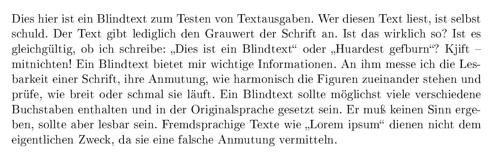
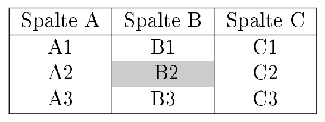
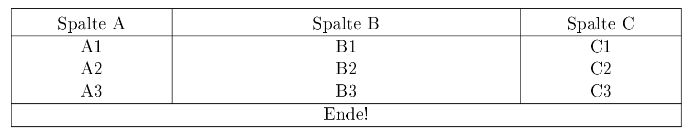
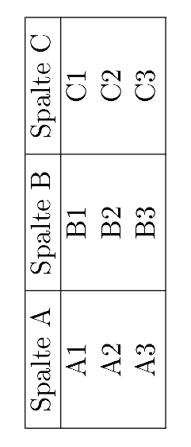

.. _Zusatzpakete:

Zusatzpakete
============

In diesem Abschnitt sollen in alphabetischer Reihenfolge einige Pakete
aufgelistet werden, die mittels der ``\usepackage``-Anweisung eingebunden werden
können und weitere hilfreiche Funktionen für spezielle Zwecke bereitstellen.

.. \usepackage[sumlimits, namelimits, reqno]{amsmath}

.. ``amsmath, amssymb`` -- Mathe-Zusatzpakete
.. ------------------------------------------

.. index:: array (Paket), Tabelle; Spaltenoptionen
.. _array:

``array`` -- Bessere Spaltenoptionen für Tabellen
-------------------------------------------------

In der Standard-Version von LaTex können, wie im Abschnitt :ref:`Spaltenoptionen
<Spaltenoptionen>` beschrieben, Spalten mit fester Breite nur linksbündig
ausgerichtet werden.

Das Paket `array
<ftp://ftp.rrzn.uni-hannover.de/pub/mirror/tex-archive/help/Catalogue/entries/array.html>`__
ermöglicht es, Spalten mit fester Breite auch zentriert oder rechtsbündig
auszurichten. Hierfür ist es sinnvoll, in der Präambel folgende "neue"
Spaltentypen zu definieren: [#]_

.. code-block:: tex

    \usepackage{array}

    \newcolumntype{L}[1]{>{\raggedright\let\newline\\\arraybackslash\hspace{0pt}}m{#1}}
    \newcolumntype{C}[1]{>{\centering\let\newline\\\arraybackslash\hspace{0pt}}m{#1}}
    \newcolumntype{R}[1]{>{\raggedleft\let\newline\\\arraybackslash\hspace{0pt}}m{#1}}

Damit können beispielsweise ``L{5cm}``, ``R{5cm}`` oder ``C{5cm}`` als
Spaltenoptionen verwendet werden, um linksbündige, rechtsbündige oder zentrierte
Spalten mit fester Breite zu definieren. Der Text wird dabei vertikal stets
zentriert ausgerichtet, also jeweils mittig in die Reihen der Tabellen gesetzt.

Soll die vertikale Ausrichtung der Zeilen jeweils bündig am unteren Zeilenrand
erfolgen, wie dies beispielsweise für das Setzen von sehr langen Spaltennamen
mittels :ref:`\rotatebox{} <Gedrehter Text>` vorteilhaft sein kann, so können
nach dem obigen Prinzip weitere Spaltentypen definiert werden, wobei lediglich
``m{#1}`` ("middle") durch ``b{#1}`` ("bottom") ersetzt werden muss.

Bei Verwendung von Spaltenoptionen mit fester Breite wird der Spaltentext bei
Bedarf automatisch in der nächsten Zeile weitergeführt. Bei Verwendung der oben
definierten Spaltenoptionen ``L``, ``C`` und ``R`` kann eine Fortsetzung des
Spaltentexts in der nächsten Zeile manuell mittels ``\newline`` explizit
erzwungen werden.

.. index:: blindtext (Paket), Blindtext
.. _blindtext:

``blindtext`` -- Blindtext setzen
---------------------------------

Das Paket `blindtext
<ftp://ftp.rrzn.uni-hannover.de/pub/mirror/tex-archive/help/Catalogue/entries/blindtext.html>`__
stellt die gleichnamige Anweisung ``\blindtext`` bereit, mit deren Hilfe -- wie
der Name schon sagt -- ein Blindtext ins Dokument eingefügt werden kann. Dabei
handelt es sich um einen Textabschnitt, der an sich keinen Sinn ergibt, aber als
"Füllmaterial" für Layout-Überlegungen dienen soll.

Das Paket bietet neben der Anweisunge ``\blindtext``, die einen einzelnen Absatz
erstellt, folgende weitere Möglichkeiten:

* ``\blindtext[x]``	erstellt einen Absatz Mustertext mit ``x`` Wiederholungen.
  [#]_
* ``\Blindtext[y][x]`` erstellt ``y`` Absätze an Mustertext mit ``x`` Wiederholungen.
* ``\blinddocument`` erstellt einen Mustertext mit :math:`3` Seiten Länge.
* ``\Blinddocument`` erstellt einen Mustertext mit :math:`16` Seiten Länge.

*Beispiel:*

.. code-block:: tex

    % In der Präambel:

    \usepackage{blindtext}

    % Im Dokument:

    \blindtext[1]

*Ergebnis:*

Zusätzlich zu den obigen Anweisungen, die "normalen" Blindtext erzeugen, gibt es
mit dem ``\blindtext``-Paket auch die Möglichkeit, beispielhafte Aufzählungen zu
erzeugen:

* ``\blinditemize`` erstellt eine Muster-Aufzählung verschiedener Punkte ohne
  Nummerierung.
* ``\blindenumerate`` erstellt eine Muster-Aufzählung verschiedener Punkte mit
  Nummerierung.

Die obigen Anweisungen können beispielsweise beim Testen anderer Dokumentklassen
(beispielsweise Brief), Schriftarten und Schriftgrößen genutzt werden.

.. booktabs
.. http://www.howtotex.com/packages/improve-your-tables-with-booktabs/

.. index:: caption (Paket)
.. _caption:

``caption`` -- Bildunterschriften ohne Nummerierung
---------------------------------------------------

Das Paket `caption
<ftp://ftp.rrzn.uni-hannover.de/pub/mirror/tex-archive/help/Catalogue/entries/caption.html>`__
stellt die Anweisung ``\caption*{}`` bereit, die beispielsweise innerhalb von
:ref:`figure <figure>`- oder :ref:`table <table>`-Umgebungen genutzt werden
kann, um Bild- beziehungsweise Tabellen-Unterschriften ohne eine automatische
Nummerierung zu setzen.

.. index:: cmap (Paket), Copy-and-Paste
.. _cmap:

``cmap`` -- Copy und Paste in PDF-Dateien
-----------------------------------------

Als das Textsatzungssystem (La-)TeX von Donald Knuth entwickelt wurde, gab es
noch keine graphischen Bedienoberflächen und noch keine Maus als
Bedienungs-Werkzeug; als Zielgeräte waren Drucker vorgesehen. Heutzutage
hingegen ist es sehr nützlich, wenn aus den erstellten PDF-Dateien der darin
enthaltene Text einfach via Copy-and-Paste in eine andere Datei übernommen
werden kann. Hierfür genügt es, in der Präambel das Zusatz-Paket `cmap
<ftp://ftp.rrzn.uni-hannover.de/pub/mirror/tex-archive/help/Catalogue/entries/cmap.html>`__
mittels ``\usepacke{cmap}`` zu laden:

.. code-block:: tex

    % Möglichst zu Beginn der Präambel:

    \usepackage{cmap}

Das Paket sollte möglichst **zu Beginn** der Präambel eingebunden werden, um
Konflikte mit anderen Zusatz-Paketen zu vermeiden. Innerhalb des Dokuments sind
keine weiteren Anweisungen nötig.

.. ``color`` -- Farbiger Text
.. --------------------------

``colortbl`` -- Tabellen mit farbigem Hintergrund
-------------------------------------------------

Das Paket `colortbl
<ftp://ftp.rrzn.uni-hannover.de/pub/mirror/tex-archive/help/Catalogue/entries/colortbl.html>`__
ermöglicht es in Kombination mit dem Paket ``xcolor``, in Tabellen auch nur
einzelne Zellen mit einer anderen Hintergrund-Farbe hervorzuheben.

*Beispiel:*

.. code-block:: tex

    % In der Präambel:

    \usepackage{xcolor, colortbl}
    \definecolor{grey}{rgb}{0.8,0.8,0.8}

    % Innerhalb des Dokuments:

        \begin{tabular}{|c|c|c|}
            \hline
            Spalte A & Spalte B & Spalte C \\
            \hline
            A1 & B1 & C1 \\
            A2 & \cellcolor{grey} B2 & C2 \\
            A3 & B3 & C3 \\
            \hline
        \end{tabular}

*Ergebnis:*

Die ``\cellcolor{}``-Anweisung kann auch im Argument der
``\multicolum{}``-Anweisung genutzt werden, um einen Bereich über mehrere
Spalten farblich hervorzuheben, beispielsweise
``\multicolumn{3}{c}{\cellcolor{grey}Hallo Welt!}``. Dabei muss allerdings genau
diese Verschachtelungs-Reihenfolge eingehalten werden, andernfalls erhält man
eine Fehlermeldung.

.. index:: geometry (Paket), \newgeometry{}, Seitenränder
.. _geometry:

``geometry`` -- Seitenränder festlegen
--------------------------------------

Das Paket `geometry
<ftp://ftp.rrzn.uni-hannover.de/pub/mirror/tex-archive/help/Catalogue/entries/geometry.html>`__
bietet eine einfache Möglichkeit, die Abstände zwischen dem Seitenrand und dem
Textbereich einer Seite manuell einzustellen. Die Syntax hierzu ist folgende:

.. code-block:: tex

    % In der Präambel:

    \usepackage[left=2.5cm, right=2.5cm, top=2.5cm, bottom=2.5cm]{geometry}

Die Angabe der einzelnen Abstände ist optional, es können somit beispielsweise
auch nur die Werte für den oberen und unteren Seitenrand (``top`` und
``bottom``) angepasst werden; für die seitlichen Ränder gelten dann weiterhin
die LaTeX-Standardwerte.

Sollen die so definierten Einstellungen, die Auswirkungen auf das gesamte
Dokument haben, zu einem späteren Zeitpunkt innerhalb des Dokuments wieder
geändert werden, so ist dies mittels der ``\newgeometry{}``-Anweisung möglich:

.. code-block:: tex

    % Innerhalb des Dokuments:

    \newgeometry{left=1cm, right=1cm, top=2.5cm, bottom=2.5cm}

Diese Anweisung hat Auswirkungen auf das Layout der aktuellen und aller
folgenden Seiten beziehungsweise bis eine neue ``\newgeometry{}``-Anweisung
gesetzt wird.

.. headsep, footskip

.. index:: hyperref (Paket), Link, Verlinkung
.. _hyperref:

``hyperref`` -- Verlinkungen erstellen
--------------------------------------

Das Paket `hyperref
<ftp://ftp.rrzn.uni-hannover.de/pub/mirror/tex-archive/help/Catalogue/entries/hyperref.html>`__
dient zur Erstellung von Verlinkungen innerhalb des erstellten PDF-Dokuments. In
der Präambel sollte dieses Pakete mittels ``\usepackage{hyperref}`` möglichst
*am Ende* geladen werden, um Konflikte mit anderen Zusatzpaketen zu vermeiden.

Bindet man dieses Paket ohne weitere Optionen ein, so werden beispielsweise
automatisch die Überschriften das Inhaltsverzeichnis in der PDF-Datei mit roten
Rahmen versehen; sofern der PDF-Betrachter dies unterstützt, kann mit der Maus
auf eine solche "Box" geklickt werden, und man gelangt zur entsprechenden Stelle
im Dokument. Die Boxen werden nur am Computer-Bildschirm angezeigt; schickt man
die Datei an einen Drucker, so werden diese nicht mit gedruckt. [#]_

Das Paket stellt die folgenden vier Anweisungen bereit:

.. index:: \url{}, Weblink

* Mit ``\url{webadresse}`` kann eine Web-Adresse anklickbar verlinkt werden. Die
  als Argument angegebene Adresse wird als Ganzes in Maschinenschrift gedruckt.

  .. code-block:: tex

      % Möglichst am Ende der Präambel:

      \usepackage{url, hyperref}

      % Innerhalb des Dokuments:

      \url{http://www.grund-wissen.de}

  Kommen in der angegebenen Webadresse Unterstriche vor, so müssen diese manuell
  mit einem vorangehenden Backslash-Zeichen versehen werden; alternativ dazu
  kann zusätzlich zum Paket ``hyperref`` das Paket :ref:`url <url>` geladen
  werden, das genau hierfür Abhilfe schafft.

.. index:: \href{}, Link; Webadresse, Link; Email, Link; Datei

* Mit ``\href{webadresse}{text}`` kann ebenfalls ein anklickbarer Link auf eine
  Webadresse gesetzt werden; es wird allerdings nicht die Web-Adresse, sondern
  der als zweites Argument angegebene Text gedruckt und dieser mit der Adresse
  verlinkt.

  .. code-block:: tex

      \href{http://www.grund-wissen.de}{Grund-Wissen-Webseite}

  Die ``\href{}``-Anweisung kann ebenso verwendet werden, um Email-Adressen zu
  setzen. Dazu muss man lediglich die Ziel-Adresse mit dem Vermerk ``mailto:``
  versehen werden: [#]_

  .. code-block:: tex

      \href{mailto:email@adresse.de}{email@adresse.de}

  In seltenen Fällen ist es auch hilfreich, mit ``\href{}`` auf lokale Dateien
  verlinken zu können. Hierzu wird der Ziel-Pfad mit dem Vermerk ``run:``
  versehen.

  .. code-block:: tex

      \href{run:/path/to/file.pdf}{Dateiname}

  Die Datei wird dann mit der für den jeweiligen Dateityp vorgesehenen
  Standard-Anwedung geöffnet.

.. index:: \ref{}, \label{}, \pageref{}, Link; Label

* Mit ``\ref{labelname}`` kann auf eine andere Stelle im aktuellen PDF-Dokument
  verlinkt werden; diese muss im LaTeX-Quellcode mittels der Anweisung
  ``\label{labelname}`` markiert werden. Als ``labelname`` sollten dabei nur
  ASCII-Symbole (Groß- und Kleinbuchstaben, Zahlen, Bindestrich, Doppelpunkt)
  verwendet werden, um mögliche Kodierungsfehler zu vermeiden. [#]_

  Verlinkt man mit der ``\ref{}``-Anweisung auf ein Label, so wird im
  PDF-Dokument an dieser Stelle der Wert des so genannten ``refstepcounters``
  eingefügt; beispielsweise könnte dieser bei der ersten Abbildung im vierten
  Abschnitt des ersten Kapitels als Ergebnis ``1.4.1`` liefern. Möchte man
  anstelle dieses Zählers die jeweilige Seitenzahl ausgeben, so ist dies mit der
  Anweisung ``\pageref{label}`` möglich. [#]_

.. todo Welche Variable steuert dies?

  .. code-block:: tex

      \section{Eine Überschrift}
      \label{sec:eine-ueberschrift}

      \ldots
      \newpage

      Hier ein Link auf die Überschrift \ref{sec:eine-ueberschrift} auf Seite
      \pageref{sec:eine-ueberschrift}.

  Eine ``\ref{}``-Anweisung kann kann durchaus an einer früheren Stelle im
  Dokument vorkommen als das zugehörige Label; tritt eine solche Situation auf,
  so muss ``pdflatex`` zweimal aufgerufen werden, um sicherzustellen, dass alle
  Links funktionieren. Beim ersten Durchlauf werden nämlich neben der PDF-Datei
  auch Hilfsdateien geschrieben, die unter anderem auch Informationen über die
  Labels beinhalten; beim erneuten Aufruf von ``pdflatex`` werden diese dann
  genutzt, um die korrekten Verlinkungen zu erstellen.

  Beim Verlinken von Tabellen und Abbildungen, in denen eine
  ``\caption{}``-Anweisung auftritt, muss das Label *nach* dieser Anweisung
  gesetzt werden, um ein korrektes Zählen der Counter-Variablen zu
  gewährleisten. Eine gute Praxis ist es zudem, den Labeln jeweils einen Vermerk
  der Art ``fig:`` für Abbildungen, ``tab:`` für Tabellen, ``sec:`` für
  Abschnitte, oder ``eq:`` für Gleichungen anzugeben; hierdurch werden Konflikte
  durch gleichnamige Label-Bezeichnungen unwahrscheinlicher.

.. index:: \hyperlink{}, \hypertarget{}

* Mit ``\hyperlink{target}{Link-Text}`` wird ein Link auf eine Textstelle erzeugt,
  die sich auch innerhalb eines Absatzes befinden kann -- beispielsweise eine
  Definition eines Fachbegriffs oder einer Abkürzung. Das jeweilige Ziel wird
  dabei mittels der Anweisung ``\hypertarget{target}{Eigentlicher Text}``
  definiert.

.. index:: \hypersetup{}, Meta-Tags

.. _hypersetup:

.. _Konfiguration des hyperref-Pakets:

.. rubric:: Konfiguration des ``hyperref``-Pakets

Das Paket ``hyperref`` bietet zudem vielerlei Möglichkeiten, das Aussehen der
Links anzupassen; dies ist mittels der Anweisung ``\hypersetup{}`` am Ende der
Präambel möglich. Unter anderem kann damit das Aussehen der Links festgelegt
werden:

.. code-block:: tex

    % Am Ende der Präambel:

    \hypersetup{

        unicode     = true,     % Umlaute in Links erlauben
        colorlinks  = true,     % Links anstelle von Umrandungsboxen farbig hervorheben
        citecolor   = green,    % Farbe von Links auf Bibliographie-Einträge festlegen
        linkcolor   = blue,     % Farbe von Links auf Sprungmarken festlegen
        urlcolor    = cyan,     % Farbe von Links auf Webseiten festlegen
        % ...
    }

Mit der ``\hypersetup{}``-Anweisung können zudem Meta-Tags in die PDF-Datei
geschrieben werden, die Informationen über den Titel des Dokuments, den
Autor-Namen usw. beinhalten; in einem PDF-Betrachter können diese als
Dokument-Eigenschaften agezeigt werden.  Insbesondere bei Veröffentlichungen im
Internet ist ein Setzen solcher Informationen empfehlenswert, da Suchmaschinen
wie Google diese in ihren Algorithmen mit auswerten.

.. code-block:: tex

    % Am Ende der Präambel:

    \hypersetup{

        % ... andere Konfigurationen ...

        pdftitle    = {Dokumentname},
        pdfsubject  = {Kurzbeschreibung},
        pdfauthor   = {Autorname},
        pdfkeywords = {Schlagwort 1} {Schlagwort 2},
        pdfnewwindow= true,
    }

Eine vollständige Liste der ``hyperref``-Optionen findet sich auch im
`LaTeX-Wörterbuch <https://de.wikibooks.org/wiki/LaTeX-Wörterbuch:_hyperref>`__.

.. \hypersetup{
    .. bookmarks=true,
    .. unicode=false,
    .. pdftoolbar=true,
    .. pdfmenubar=true,
    .. pdffitwindow=false,
    .. pdfstartview={FitH},
    .. pdftitle={My title},
    .. pdfauthor={Author},
    .. pdfsubject={Subject},
    .. pdfcreator={Creator},
    .. pdfproducer={Producer},
    .. pdfkeywords={keyword1} {key2} {key3},
    .. pdfnewwindow=true,
    .. colorlinks=false,
    .. linkcolor=red,
    .. citecolor=green,
    .. filecolor=magenta,
    .. urlcolor=cyan
.. }

.. https://en.wikibooks.org/wiki/LaTeX/Hyperlinks

.. \hyperref[label_name]{''link text''}
.. We use \hyperref[mainlemma]{lemma \ref*{mainlemma} }.
.. with the hyperlink as expected. Note the "*" after \ref for avoiding nested hyperlinks.
.. Or, to incorporate the url package's formatting and line breaking abilities
.. into the displayed text, use[2]

.. When using this form, note that the \nolinkurl command is fragile and if the
.. hyperlink is inside of a moving argument, it must be preceeded by a \protect
.. command.

.. By default, URLs are printed using mono-spaced fonts. If you don't like it
.. and you want them to be printed with the same style of the rest of the text, you
.. can use this:

.. \urlstyle{same}

.. lmodern: etwas verbesserte Version der Computer Modern Schrift
.. Einfach mit ``\usepackage{lmodern}`` einbinden und glücklich sein ;-)

.. index:: longtable (Paket), Tabelle; mehrseitig
.. _longtable:

``longtable`` -- Mehrseitige Tabellen
-------------------------------------

Das Paket `longtable
<ftp://ftp.rrzn.uni-hannover.de/pub/mirror/tex-archive/help/Catalogue/entries/longtable.html>`__
stellt eine gleichnamige Umgebung bereit, die zum Erstellen von beliebig langen
Tabellen verwendet werden kann. Die Syntax ist dabei im Wesentlichen an die
``tabular``-Umgebung angelehnt; es können allerdings unterschiedliche Kopf- unf
Fußzeilen für die erste Seite der Tabelle sowie für die folgenden
Tabellen-Seiten definiert werden.

*Beispiel:*

.. code-block:: tex

    % In der Präambel:

    \usepackage{multicol}
    \usepackage{array, longtable}
    \newcolumntype{L}[1]{>{\raggedright\let\newline\\\arraybackslash\hspace{0pt}}m{#1}}
    \newcolumntype{C}[1]{>{\centering  \let\newline\\\arraybackslash\hspace{0pt}}m{#1}}
    \newcolumntype{R}[1]{>{\raggedleft \let\newline\\\arraybackslash\hspace{0pt}}m{#1}}

    % Im Dokument:

    \begin{longtable}{|C{3cm}|C{7cm}|C{3cm}|}
        \hline
        &&\\[-11pt]

        % Kopfzeile zu Beginn der Tabelle:
        Spalte A & Spalte B & Spalte C \\
        \hline \endfirsthead

        % Kopfzeile für die Folgeseiten:
        A & B & C \\
        \hline \endhead

        % Fußzeilen bei Seiten-Umbrüchen mitten in der Tabelle:
        \multicolumn{3}{|c|}{Fortsetzung folgt...} \\
        \hline \endfoot

        % Fußzeile am Ende der Tabelle:
        \multicolumn{3}{|c|}{Ende!}\\
        \hline \endlastfoot

        % Eigentlicher Tabellen-Inhalt:
        A1 & B1 & C1 \\
        A2 & B2 & C2 \\
        A3 & B3 & C3 \\
        \hline
    \end{longtable}

*Ergebnis:*

In diesem Beispiel wurden wieder die im Abschnitt :ref:`Tabular <Tabular>`
beschriebenen Eigen-Definitionen für zentrierte Spalten mit fester Breite
genutzt. Da der eigentliche Tabellen-Inhalt im Beispiel nur sehr kurz ist und
auf eine Seite passt, wird nur der erste Tabellenkopf sowie die Fußzeile für das
Tabellen-Ende gedruckt.

Der Aufbau einer ``longtable`` unterscheidet sich also nur durch die explizite
Definition der Kopf- und Fußzeilen von einer "normalen" ``tabular``-Umgebung.
[#]_
Der wesentliche Vorteil liegt dabei darin, dass man sich keine Gedanken darüber
machen muss, an welcher Stelle die Seitentrennung erfolgt -- LaTeX übernimmt
dies von selbst.

.. index:: lscape (Paket), landscape (Umgebung), Querformat
.. _lscape:

``lscape`` -- Bereiche in Querformat setzen
-------------------------------------------

Das Paket `lscape
<ftp://ftp.rrzn.uni-hannover.de/pub/mirror/tex-archive/help/Catalogue/entries/lscape.html>`__
stellt die Umgebung ``landscape`` bereit, mit deren Hilfe einzelne Bereiche
eines Dokuments im Querformat gedruckt werden können. Dies ist beispielsweise
für breite Tabellen hilfreich.

*Beispiel:*

.. code-block:: tex

    % In der Präambel:

    \usepackage{lscape}

    % Im Dokument:

    \begin{landscape}

        \begin{tabular}{|c|c|c|}
            \hline
            Spalte A & Spalte B & Spalte C \\
            \hline
            A1 & B1 & C1 \\
            A2 & B2 & C2 \\
            A3 & B3 & C3 \\
            \hline
        \end{tabular}

    \end{landscape}

*Ergebnis:*

Der entsprechende Bereich muss also lediglich durch ``\begin{landscape}`` und
``\end{landscape}`` eingeschlossen werden.

.. Allerdings fängt landscape immer eine neue Seite an.
.. Umgebung ``\begin{turn}{90} ... \end{turn}? Welches Paket?

.. ``mdframed`` -- Selbstdefinierte Hinweisboxen
.. ---------------------------------------------

.. \usepackage{microtype}

.. The microtype package improves the spacing between words and letters. It does a
.. lot more and most people won’t notice the difference. But still, the resulting
.. document will be easier to read and looks better when microtype is loaded. Load
.. this package after fonts, if any, as the package behavior is dependent on this
.. font.

.. index:: multicol (Paket), \multicolumn{}
.. _multicol:

``multicol`` -- Tabelleneinträge über mehrere Spalten
-----------------------------------------------------

Das Paket `multicol
<ftp://ftp.rrzn.uni-hannover.de/pub/mirror/tex-archive/help/Catalogue/entries/multicol.html>`__
stellt die Anweisung ``\multicolumn{}`` bereit, mit deren Hilfe Einträge in
Tabellen über mehrere Spalten hinweg gesetzt werden können. Die Syntax hierfür
ist folgende:

.. code-block:: tex

    % In der Präambel:

    \usepackage{multicol}

    % Innerhalb des Dokuments:

    \multicolumn{AnzahlSpalten}{Ausrichtung}{Text}

Die Ausrichtung des angegebenen Textes beginnt dann mit in der Spalte, in der
die ``\multicolumn{}``-Anweisung steht, und umfasst insgesamt die mit
``AnzahlSpalten`` angegebene Anzahl an Spalten. Als Ausrichtung kann ``l``,
``c`` oder ``r`` gewählt werden; Trennstriche am linken beziehungsweise rechten
Rand des ``multicolumn``-Eintrags können mittels eines ``|``-Zeichens vor
beziehungsweise nach dem Ausrichtungs-Zeichen gesetzt werden.

.. index:: multirow (Paket), \multirow{}
.. _multirow:

``multirow`` -- Tabelleneinträge über mehrere Zeilen
----------------------------------------------------

Das Paket `multirow
<ftp://ftp.rrzn.uni-hannover.de/pub/mirror/tex-archive/help/Catalogue/entries/multirow.html>`__
stellt die gleichnamige Anweisung ``\multirow{}`` bereit, mit deren Hilfe
Einträge in Tabellen über mehrere Zeilen hinweg ausgerichtet werden können. Die
Syntax hierfür ist folgende:

.. code-block:: tex

    % In der Präambel:

    \usepackage{multirow}

    % Innerhalb des Dokuments:

    \multirow{AnzahlReihen}{Breite}{Text}

Die Ausrichtung des angegebenen Textes innerhalb der Spalte, in der die
``\multirow{}``-Anweisung steht,  beginnt mit der aktuellen Reihe und umfasst
insgesamt die mit ``AnzahlReihen`` angegebene Anzahl an Reihen. Der Inhalt der
Reihe wird zentriert zu den mit ``AnzahlReihen`` angegebenen Reihen
ausgerichtet. Als vertikal für den Text zu reservierende Breite wird meist
``*`` für eine automatische Breite gewählt, die Breite der auszurichtenden Reihe
entspricht dann der Breite der angegebenen Anzahl von Reihen.

.. index:: paralist (Paket)
.. _paralist:

``paralist`` -- Kompakte Aufzählungen
-------------------------------------

Das Paket `paralist
<ftp://ftp.rrzn.uni-hannover.de/pub/mirror/tex-archive/help/Catalogue/entries/paralist.html>`__
stellt die Umgebungen ``compactitem`` und ``compactenum``  bereit, mit deren Hilfe
kompakte Aufzählungen gesetzt werden können:

.. code-block:: tex

    % Kompakte Aufzählung ohne Nummerierung:
    \begin{compactitem}
        \item Eintrag 1
        \item Eintrag 2
    \end{compactitem}

    % Kompakte Aufzählung mit Nummerierung:
    \begin{compactenum}
        \item Eintrag 1
        \item Eintrag 2
    \end{compactenum}

.. -----------------------------

.. Paket tabularx: Hiermit kann man sehr einfach die Tabellenbreite eine Tabelle
.. definieren und mit einem neuen Spaltentyp X wird die Tabelle gleichmäßig über
.. noch zur Verfügung stehenden Breite verteilt.
.. \begin{tabularx}{1\linewidth}{|p{4cm}|X|X|X|X|X|X|}
.. \hline ...

.. Paket ``truncate``: Es stellt eine Anweisung bereit, mit dem sich ein
.. vorgegebener Text auf eine bestimmte Länge kürzen lässt:
.. \truncate[ zeichen ]{ breite }{ text }
.. Wenn das Argument text für die angegebene breite zu groß ist, wird es
.. abgeschnitten.
.. Gut für Kapitel-Überschriften in Kopfzeilen!

.. index:: units (Paket), Einheiten
.. _units:

``units`` -- Einheiten setzen
-----------------------------

In der Typographie ist es allgemein üblich, mathematische oder physikalische
Symbole kursiv zu drucken, die zugehörigen Einheiten hingegen in aufrechter
Schriftform ("roman"). Um insbesondere bei der Eingabe von Einheiten im
Mathe-Modus nicht ständig den Schrift-Typ ändern zu müssen, kann anstelle dessen
in der Präambel das Paket ``units`` mittels ``\usepackage{units``} eingebunden
werden.

Das Paket `units
<ftp://ftp.rrzn.uni-hannover.de/pub/mirror/tex-archive/help/Catalogue/entries/units.html>`__
stellt die Anweisung ``\units[Zahlenwert]{Einheit}`` bereit, die sowohl in Text-
wie auch in Mathe-Umgebungen genutzt werden kann; sie stellt einerseits sicher,
dass die angegebene Einheit aufrecht gedruckt wird, andererseits verringert sie
geringfügig den horizontalen Abstand zwischen Zahlenwert und Einheit, so dass
diese optisch als zusammengehörig, aber nicht gequetscht erscheinen. Die Angabe
des Zahlenwerts ist optional, es kann also auch nur ``\units{Einheit}`` gesetzt
werden, beispielsweise um beim Setzen physikalischer Aufgaben eine
Einheiten-Kontrolle vorzunehmen.

Sowohl bei der Angabe des Zahlenwerts wie auch bei der Angabe der Einheit dürfen
weitere mathematische Anweisungen gesetzt werden; beispielsweise kann mittels
``\unit{\frac{km}{h}}`` die Ausgabe :math:`\unit{\frac{km}{h}}` erzeugt werden.
Eine solche Bruch-Schreibweise wird häufig bei Formeln verwendet, die eigene
Absätze darstellen; bei Angaben von Einheiten innerhalb einer Zeile kann
hingegen die zusätzlich bereitgestellte Anweisung
``\unitfrac[Zahlenwert]{Zähler}{Nenner}`` verwendet werden, die beispielsweise
für den Quellcode ``\unitfrac{km}{h}`` die Ausgabe :math:`\unitfrac{km}{h}`
liefert.

.. index:: url (Paket), URLs
.. _url:

``urls`` -- Links auf Webseiten
-------------------------------

Bindet man dieses Paket mittels ``\usepackage{url}`` in die Präambel ein, so
müssen innerhalb von ``\url{}``-Anweisungen nicht manuell Backslash-Symbols
``\`` vor Unterstriche gesetzt werden; diese sind in LaTeX prinzipiell ja nur
für den Mathe-Modus vorgesehen, um tiefgestellten Text zu erzeugen.

Das Paket `url
<ftp://ftp.rrzn.uni-hannover.de/pub/mirror/tex-archive/help/Catalogue/entries/url.html>`__
bewirkt, dass Unterstriche in Web-Adressen, auf die mittels der
``\url{}``-Anweisung verlinkt wird, keinen Ärger mehr bereiten. Üblicherweise
wird das ``url``-Paket zusätzlich zum Paket :ref:`hyperref <hyperref>`
verwendet, welches die mittels der ``\url{}``-Anweisung erstellten Links
"anklickbar" macht; das Paket ``url`` sollte in der Präambel hierbei **vor** dem
``hyperref``-Paket geladen werden.

.. Paket ziffer: Damit im Mathemodus das Komma schöner aussieht

.. xcolor als Nachfolger von color
.. Das Paket xcolor stellt folgende Farben zu Verfügung: black, blue, brown,
.. cyan, darkgray, gray, green, lightgray, lime, magenta, olive, orange, pink,
.. purple, red, teal, violet, white und yellow; weitere Farben können selbst
.. definiert werden.

.. raw:: html

    

.. only:: html

    .. rubric:: Anmerkungen:

.. [#] Der Tipp stammt von `dieser Seite
    <https://tex.stackexchange.com/questions/12703/how-to-create-fixed-width-table-columns-with-text-raggedright-centered-raggedlef>`__.

.. [#] Da das Argument ``x`` in eckige Klammern gesetzt wird, kann es also auch
    weggelassen werden; für ``x`` wird dann der Standardwert (hier: ``1``)
    verwendet.

.. [#] Möchte man die farbigen Umrandungsboxen auch in der PDF-Version
    deaktivieren und dafür die Verlinungen durch eine blaue Schriftfarbe
    hervorheben, so ist dies mittels ``\hypersetup{colorlinks=true,
    linkcolor=blue}`` möglich (siehe Abschnitt :ref:`Konfiguration des
    hyperref-Pakets <Konfiguration des hyperref-Pakets>`).

.. [#] Auch für das Setzen von Email-Adressen ist das Zusatzpaket :ref:`url
    <url>` nützlich, um nicht weiter auf mögliche Unterstrich-Zeichen achten zu
    müssen.

.. [#] Die Anweisungen ``\label{}``, ``\ref{}`` und ``\pageref{}`` können, wie
    bereits im Abschnitt :ref:`Querverweise <Querverweise>` beschrieben, auch
    ohne Einbindung des Pakets ``hyperref`` verwendet werden; in den PDF-Dateien
    sind die jeweiligen Stellen dann aber nicht anklickbar.

.. [#] Als zusätzliche Alternative kann das Paket ``nameref`` verwendet werden,
    das die gleichnamige Anweisung ``\nameref{}`` bereitstellt. Diese gibt den
    Inhalt des jeweils verlinkten Labels aus. Steht beispielsweise ein Label
    ``\label{sec:Abschnittsname}`` hinter einer Überschrift, so wird der Name
    der Überschrift als Linkbezeichnung ausgegeben; hat man die Überschrift mit
    ``\section[Kurzbezeichnung]{Langer Überschriftsname}`` gesetzt, so wird nur
    die Kurzbezeichnung gedruckt.

.. Das Paket varioref stellt Anweisung ``\vref{}`` mit kontext-bezogenen Links bereit

.. [#] Leider können in einer ``longtable`` waagrechte Linien nur mittels
    ``\hline``, nicht jedoch mittels ``\toprule``, ``\midrule`` und
    ``\bottomrule`` gesetzt werden.

    Möchte man beispielsweise den Abstand zwischen einer ``\hline`` und dem
    nachfolgenden Text vergrößern, so muss bei einer vierspaltigen Tabelle und
    Schriftgrad ``10`` auf eine Anweisung der Form ``&&&\\[-8pt]``
    zurückgegriffen werden. Sie bewirkt, dass eine weitere (komplette) Zeile mit
    leeren Spalteneinträgen eingefügt wird; der vertikale Abstand zum folgenden,
    eigentlichen Tabellen-Inhalt würde somit um ``10pt`` erhöht. Durch die
    zusätzliche Angabe von ``[-8pt]`` hinter dem Zeilen-Trennzeichen wird die
    folgende Zeile allerdings um ``8pt`` nach oben verschoben. Dadurch
    resultiert schließlich ein Abstand von ``2pt`` zur davor platzierten
    ``\hline``.
